# Rancangan Struktur Database
## SiJaga — Ekosistem Surgicare, Angsmart, ANSafe & Landing Page

**Versi:** 1.3 — Rename modul Surgicon → Surgicare, penetapan nama aplikasi keseluruhan: **SiJaga**. Tambahan: Fitur Keluarga (Family Support Checklist) & Quiz Pemahaman Guide (Surgicare)
**Prinsip desain:** Master Data Pasien tunggal, normalisasi hingga 3NF pada entitas transaksional, audit trail penuh, JSON dipakai seminimal mungkin (hanya untuk snapshot, bukan sumber kebenaran utama).

> **Ringkasan perubahan dari v1.2:**
> 1. **Fitur Keluarga** — akun terpisah untuk keluarga pasien (`family_members`), dengan daftar dukungan berbeda untuk Pre-OP vs Post-OP (`support_item_master`), masing-masing punya checklist selesai/belum (`family_support_checklist_answers`).
> 2. **Quiz Pemahaman Guide** — setelah pasien membaca guide, diberi kuis (`guide_quiz_questions` + `guide_quiz_options`), hasilnya (`patient_guide_quiz_attempts` + `patient_guide_quiz_answers`) dikirim ke perawat untuk diverifikasi apakah pasien perlu edukasi lanjutan.

---

## 1. Asumsi & Keputusan Desain

Beberapa hal di PRD ditulis ringkas; untuk kebutuhan produksi, hal tersebut dinormalisasi menjadi tabel master + detail agar bisa diaudit per-item, dicari, dan dilaporkan. Keputusan lain:

1. **Satu tabel `users`** untuk semua staf (perawat Surgicare, perawat ruangan, kepala ruangan, admin/IT), dibedakan lewat `role_id`. Pasien dan keluarga pasien **tidak** disimpan di `users` — masing-masing punya jalur otentikasi sendiri.
2. **RBAC** dimodelkan granular per modul (`role_module_access`) agar matriks RBAC bisa diatur tanpa ubah kode.
3. **Pola master–header–detail** dipakai berulang untuk semua jenis checklist di sistem ini (checklist perawat Pre/Post-OP, checklist pemahaman guide pasien, checklist dukungan keluarga) — konsisten, mudah diaudit, dan gampang ditambah/kurangi poinnya tanpa migrasi.
4. **Akun keluarga terpisah dari akun pasien** (`family_members`), karena satu pasien bisa didampingi lebih dari satu anggota keluarga, dan aksesnya harus bisa dicabut/diaktifkan independen dari akses pasien sendiri.
5. **Daftar dukungan keluarga dibedakan per fase** (`support_item_master.phase_type`), sama seperti pola `guide_checklist_items.guide_type` — satu tabel master dengan kolom pembeda fase, bukan dua tabel terpisah, supaya query dan pemeliharaan konten lebih sederhana.
6. **Quiz dinilai otomatis dari opsi yang ditandai benar** (`guide_quiz_options.is_correct`), lalu hasilnya masuk status *pending review* sampai perawat menindaklanjuti — skor tidak langsung dipercaya sebagai keputusan final, tetap ada langkah verifikasi manusia sesuai kebutuhan klinis.
7. **`nursing_cares` dibuat otomatis** saat pasien baru ditambahkan (trigger aplikasi/DB).
8. **`shift_reports` dirancang sebagai rantai catatan** (bukan handover formal 2 pihak) lewat `previous_report_id`.
9. Tabel bertanda **(Fase 2)** tidak wajib ada di rilis MVP tapi disertakan agar skema tidak perlu migrasi besar nanti.

Konvensi penamaan: nama tabel plural, `snake_case`, PK selalu `id`, FK selalu `<singular_entity>_id` (mis. `patient_id`, `nurse_id`, `family_member_id`).

---

## 2. Diagram ERD (Mermaid)

```mermaid
erDiagram
    ROLES ||--o{ USERS : "has"
    ROLES ||--o{ ROLE_MODULE_ACCESS : "governs"

    USERS ||--o{ PATIENTS : "registers"
    USERS ||--o{ PREOP_VERIFICATIONS : "verifies"
    USERS ||--o{ POSTOP_VERIFICATIONS : "verifies"
    USERS ||--o{ NURSING_CARES : "records"
    USERS ||--o{ SHIFT_REPORTS : "writes"
    USERS ||--o{ NURSING_CARE_PLANS : "prepares"
    USERS ||--o{ MFS_ASSESSMENTS : "assesses"
    USERS ||--o{ PATIENT_GUIDE_LOGS : "confirms on behalf of"
    USERS ||--o{ PATIENT_GUIDE_QUIZ_ATTEMPTS : "reviews"
    USERS ||--o{ FAMILY_MEMBERS : "registers"
    USERS ||--o{ AUDIT_LOGS : "performs action"
    USERS ||--o{ NOTIFICATIONS : "receives"

    PATIENTS ||--o{ PATIENT_GUIDE_LOGS : "has read log"
    PATIENTS ||--o{ PREOP_VERIFICATIONS : "is verified"
    PATIENTS ||--o{ POSTOP_VERIFICATIONS : "is verified"
    PATIENTS ||--|| NURSING_CARES : "has (1 active)"
    PATIENTS ||--o{ SHIFT_REPORTS : "has chained reports"
    PATIENTS ||--o{ NURSING_CARE_PLANS : "has plan"
    PATIENTS ||--o{ MFS_ASSESSMENTS : "is fall-risk assessed"
    PATIENTS ||--o{ PATIENT_ACCESS_TOKENS : "has access token"
    PATIENTS ||--o{ NOTIFICATIONS : "triggers"
    PATIENTS ||--o{ FAMILY_MEMBERS : "has family accounts"
    PATIENTS ||--o{ FAMILY_SUPPORT_CHECKLIST_ANSWERS : "has support checklist"
    PATIENTS ||--o{ PATIENT_GUIDE_QUIZ_ATTEMPTS : "attempts quiz"

    SHIFT_REPORTS ||--o| SHIFT_REPORTS : "continues from (previous_report_id)"

    GUIDE_CONTENTS ||--o{ PATIENT_GUIDE_LOGS : "is read via"
    GUIDE_CHECKLIST_ITEMS ||--o{ PATIENT_GUIDE_CHECKLIST_ANSWERS : "referenced by"
    PATIENT_GUIDE_LOGS ||--o{ PATIENT_GUIDE_CHECKLIST_ANSWERS : "consists of"
    PATIENT_GUIDE_LOGS ||--o{ PATIENT_GUIDE_QUIZ_ATTEMPTS : "leads to (optional)"

    GUIDE_QUIZ_QUESTIONS ||--o{ GUIDE_QUIZ_OPTIONS : "has"
    GUIDE_QUIZ_QUESTIONS ||--o{ PATIENT_GUIDE_QUIZ_ANSWERS : "referenced by"
    GUIDE_QUIZ_OPTIONS ||--o{ PATIENT_GUIDE_QUIZ_ANSWERS : "chosen in"
    PATIENT_GUIDE_QUIZ_ATTEMPTS ||--o{ PATIENT_GUIDE_QUIZ_ANSWERS : "consists of"

    FAMILY_MEMBERS ||--o{ FAMILY_SUPPORT_CHECKLIST_ANSWERS : "marks"
    SUPPORT_ITEM_MASTER ||--o{ FAMILY_SUPPORT_CHECKLIST_ANSWERS : "referenced by"

    VERIFICATION_ITEM_MASTER ||--o{ PREOP_VERIFICATION_DETAILS : "referenced by"
    VERIFICATION_ITEM_MASTER ||--o{ POSTOP_VERIFICATION_DETAILS : "referenced by"
    PREOP_VERIFICATIONS ||--o{ PREOP_VERIFICATION_DETAILS : "consists of"
    POSTOP_VERIFICATIONS ||--o{ POSTOP_VERIFICATION_DETAILS : "consists of"

    NURSING_DIAGNOSIS_MASTER ||--o{ NURSING_CARE_PLANS : "referenced by"

    MFS_INDICATOR_MASTER ||--o{ MFS_INDICATOR_OPTIONS : "has"
    MFS_INDICATOR_OPTIONS ||--o{ MFS_ASSESSMENT_DETAILS : "chosen in"
    MFS_ASSESSMENTS ||--o{ MFS_ASSESSMENT_DETAILS : "consists of"

    EDUCATION_VIDEOS {
        int id PK
    }
    DOCTORS {
        int id PK
    }
    TESTIMONIALS {
        int id PK
    }
    LANDING_CONTENTS {
        int id PK
    }
```

> Catatan: `EDUCATION_VIDEOS`, `DOCTORS`, `TESTIMONIALS`, `LANDING_CONTENTS` sengaja berdiri sendiri (tidak ber-FK ke Patients/Users) karena sifatnya konten publik landing page yang dikelola Admin/IT, bukan data klinis.

---

## 3. Kamus Tabel Lengkap

### 3.1 Identitas, RBAC & Master Data

**`roles`**
| Kolom | Tipe | Keterangan |
|---|---|---|
| id | INT, PK | |
| role_name | VARCHAR(50), UNIQUE | Surgicare Nurse, Ward Nurse, Fall-Risk Assessor Nurse, Head Nurse/Supervisor, Admin/IT |
| description | TEXT | |
| created_at | TIMESTAMP | |

**`users`** (seluruh staf)
| Kolom | Tipe | Keterangan |
|---|---|---|
| id | INT, PK | |
| role_id | INT, FK → roles.id | |
| name | VARCHAR(150) | |
| email | VARCHAR(150), UNIQUE | |
| username | VARCHAR(50), UNIQUE | |
| password_hash | VARCHAR(255) | |
| license_number | VARCHAR(50), NULLABLE | No. STR/SIP tenaga medis |
| work_unit | VARCHAR(100), NULLABLE | OK, Ruang Rawat Inap, dst. |
| is_active | BOOLEAN, DEFAULT true | |
| created_at, updated_at | TIMESTAMP | |

**`role_module_access`** (matriks RBAC)
| Kolom | Tipe | Keterangan |
|---|---|---|
| id | INT, PK | |
| role_id | INT, FK → roles.id | |
| module | ENUM('SURGICARE','ANGSMART','ANSAFE','LANDING_ADMIN') | |
| access_level | ENUM('NONE','VIEW','VIEW_INPUT','FULL') | |
| UNIQUE(role_id, module) | | Constraint komposit |

**`patients`** (Master Data — jantung integrasi ketiga modul)
| Kolom | Tipe | Keterangan |
|---|---|---|
| id | INT/UUID, PK | |
| medical_record_no | VARCHAR(30), UNIQUE, NOT NULL | No. RM — validasi unik lintas ekosistem |
| name | VARCHAR(150) | |
| date_of_birth | DATE | dipakai untuk umur & otentikasi pasien |
| gender | ENUM('M','F') | |
| room_bed | VARCHAR(20), NULLABLE | |
| diagnosis | TEXT | |
| procedure_type | VARCHAR(150) | |
| phase_status | ENUM('PRE_OP','INTRA_OP','POST_OP','INPATIENT_CARE','DISCHARGED') | sumber kebenaran status card di Beranda Surgicare/Angsmart |
| surgery_schedule | DATETIME, NULLABLE | dipakai logika alert "< 2 jam belum baca guide" |
| patient_access_code | VARCHAR(20), UNIQUE | token akses portal pasien |
| created_by | INT, FK → users.id | perawat yang mendaftarkan |
| created_at, updated_at | TIMESTAMP | |

**`patient_access_tokens`**
| Kolom | Tipe | Keterangan |
|---|---|---|
| id | INT, PK | |
| patient_id | INT, FK → patients.id | |
| token | VARCHAR(64), UNIQUE | |
| expired_at | TIMESTAMP | |
| is_used | BOOLEAN | |
| created_at | TIMESTAMP | |

**`family_members`** *(tabel baru — akun keluarga pasien)*
| Kolom | Tipe | Keterangan |
|---|---|---|
| id | INT, PK | |
| patient_id | INT, FK → patients.id | |
| name | VARCHAR(150) | |
| relationship | VARCHAR(50) | mis. "Anak", "Suami/Istri", "Orang Tua" |
| phone_number | VARCHAR(20), NULLABLE | |
| family_access_code | VARCHAR(20), UNIQUE | kode akses portal keluarga (terpisah dari `patient_access_code`) |
| registered_by | INT, FK → users.id | perawat yang mendaftarkan akun keluarga |
| is_active | BOOLEAN, DEFAULT true | perawat bisa nonaktifkan akses jika perlu |
| created_at | TIMESTAMP | |

---

### 3.2 Modul Surgicare

**`guide_contents`** (materi Pre-OP/Post-OP Guide)
| Kolom | Tipe | Keterangan |
|---|---|---|
| id | INT, PK | |
| guide_type | ENUM('PRE_OP','POST_OP') | |
| title | VARCHAR(200) | |
| content | TEXT/JSON | teks, gambar, atau video embed |
| sort_order | INT | urutan tampil poin panduan |
| is_published | BOOLEAN | |
| updated_at | TIMESTAMP | |

**`patient_guide_logs`**
| Kolom | Tipe | Keterangan |
|---|---|---|
| id | INT, PK | |
| patient_id | INT, FK → patients.id | |
| guide_content_id | INT, FK → guide_contents.id, NULLABLE | versi guide yang dibaca |
| guide_type | ENUM('PRE_OP','POST_OP') | |
| is_read | BOOLEAN, DEFAULT false | |
| read_at | TIMESTAMP, NULLABLE | |
| checklist_status | ENUM('NOT_STARTED','IN_PROGRESS','COMPLETED'), DEFAULT 'NOT_STARTED' | otomatis `COMPLETED` saat semua poin di `patient_guide_checklist_answers` tercentang; memicu quiz tersedia untuk diakses |
| checklist_completed_at | TIMESTAMP, NULLABLE | |
| checked_by_nurse | BOOLEAN, DEFAULT false | skenario perawat bantu centang atas konfirmasi lisan |
| confirmed_by_user_id | INT, FK → users.id, NULLABLE | wajib diisi jika `checked_by_nurse = true` |
| created_at | TIMESTAMP | |

**`guide_checklist_items`** (master poin checklist "sudah memahami guide")
| Kolom | Tipe | Keterangan |
|---|---|---|
| id | INT, PK | |
| guide_type | ENUM('PRE_OP','POST_OP') | |
| item_text | VARCHAR(255) | mis. "Saya paham prosedur puasa sebelum operasi" |
| sort_order | INT | |
| is_active | BOOLEAN | |

**`patient_guide_checklist_answers`** (jawaban pasien per poin checklist)
| Kolom | Tipe | Keterangan |
|---|---|---|
| id | INT, PK | |
| patient_guide_log_id | INT, FK → patient_guide_logs.id | |
| checklist_item_id | INT, FK → guide_checklist_items.id | |
| is_checked | BOOLEAN, DEFAULT false | |
| checked_at | TIMESTAMP, NULLABLE | |
| UNIQUE(patient_guide_log_id, checklist_item_id) | | satu jawaban per poin per log |

**`guide_quiz_questions`** *(tabel baru — master pertanyaan kuis pemahaman)*
| Kolom | Tipe | Keterangan |
|---|---|---|
| id | INT, PK | |
| guide_type | ENUM('PRE_OP','POST_OP') | kuis berbeda untuk tiap fase guide |
| question_text | TEXT | |
| sort_order | INT | |
| is_active | BOOLEAN | |

**`guide_quiz_options`** *(tabel baru — pilihan jawaban per pertanyaan)*
| Kolom | Tipe | Keterangan |
|---|---|---|
| id | INT, PK | |
| question_id | INT, FK → guide_quiz_questions.id | |
| option_text | VARCHAR(255) | |
| is_correct | BOOLEAN | dipakai untuk penilaian skor otomatis |
| sort_order | INT | |

**`patient_guide_quiz_attempts`** *(tabel baru — header hasil kuis pasien)*
| Kolom | Tipe | Keterangan |
|---|---|---|
| id | INT, PK | |
| patient_id | INT, FK → patients.id | |
| guide_type | ENUM('PRE_OP','POST_OP') | |
| patient_guide_log_id | INT, FK → patient_guide_logs.id, NULLABLE | tautan opsional ke log guide yang mendahului kuis ini |
| total_score | INT | jumlah jawaban benar, dihitung otomatis |
| max_score | INT | total pertanyaan aktif saat kuis diambil |
| verification_status | ENUM('PENDING_REVIEW','NEEDS_FURTHER_EDUCATION','UNDERSTOOD'), DEFAULT 'PENDING_REVIEW' | hasil tinjauan perawat |
| reviewed_by_user_id | INT, FK → users.id, NULLABLE | perawat yang memverifikasi |
| reviewed_at | TIMESTAMP, NULLABLE | |
| submitted_at | TIMESTAMP | waktu pasien submit kuis; memicu notifikasi ke perawat |

**`patient_guide_quiz_answers`** *(tabel baru — jawaban pasien per pertanyaan kuis)*
| Kolom | Tipe | Keterangan |
|---|---|---|
| id | INT, PK | |
| quiz_attempt_id | INT, FK → patient_guide_quiz_attempts.id | |
| question_id | INT, FK → guide_quiz_questions.id | |
| selected_option_id | INT, FK → guide_quiz_options.id | |
| is_correct | BOOLEAN | *cache* dari `guide_quiz_options.is_correct` saat dijawab, untuk histori tetap akurat meski master opsi berubah kemudian |
| UNIQUE(quiz_attempt_id, question_id) | | satu jawaban per pertanyaan per attempt |

**`support_item_master`** *(tabel baru — daftar dukungan keluarga, beda per fase)*
| Kolom | Tipe | Keterangan |
|---|---|---|
| id | INT, PK | |
| phase_type | ENUM('PRE_OP','POST_OP') | Pre-OP: bantu persiapan (cukur, puasa, dst.); Post-OP: dukungan emosional, dst. |
| item_text | VARCHAR(255) | mis. "Membantu mencukur area operasi", "Memberi dukungan emosional pasca operasi" |
| sort_order | INT | |
| is_active | BOOLEAN | |

**`family_support_checklist_answers`** *(tabel baru — status dukungan yang sudah/belum dilakukan)*
| Kolom | Tipe | Keterangan |
|---|---|---|
| id | INT, PK | |
| patient_id | INT, FK → patients.id | |
| support_item_id | INT, FK → support_item_master.id | |
| is_done | BOOLEAN, DEFAULT false | |
| done_at | TIMESTAMP, NULLABLE | |
| done_by_family_id | INT, FK → family_members.id, NULLABLE | anggota keluarga yang menandai selesai |
| notes | TEXT, NULLABLE | |
| UNIQUE(patient_id, support_item_id) | | satu status per poin dukungan per pasien |

**`verification_item_master`** (daftar poin checklist perawat, dipakai Pre-OP & Post-OP)
| Kolom | Tipe | Keterangan |
|---|---|---|
| id | INT, PK | |
| type | ENUM('PRE_OP','POST_OP') | |
| item_name | VARCHAR(200) | mis. "Identity verified", "Fasting status", "Surgical site marking" |
| sort_order | INT | |
| is_active | BOOLEAN | |

**`preop_verifications`** (header transaksi)
| Kolom | Tipe | Keterangan |
|---|---|---|
| id | INT, PK | |
| patient_id | INT, FK → patients.id | |
| nurse_id | INT, FK → users.id | |
| status | ENUM('DRAFT','COMPLETED') | "Completed" memicu perubahan `patients.phase_status` → INTRA_OP |
| notes | TEXT | |
| recorded_at | TIMESTAMP | |

**`preop_verification_details`**
| Kolom | Tipe | Keterangan |
|---|---|---|
| id | INT, PK | |
| preop_verification_id | INT, FK → preop_verifications.id | |
| item_master_id | INT, FK → verification_item_master.id | |
| is_checked | BOOLEAN | |
| item_note | VARCHAR(255), NULLABLE | |
| UNIQUE(preop_verification_id, item_master_id) | | |

**`postop_verifications`** & **`postop_verification_details`** — struktur identik dengan pasangan Pre-OP di atas (header + detail), merujuk `verification_item_master` dengan `type = 'POST_OP'`. "Completed" pada tabel ini memicu `patients.phase_status` → INPATIENT_CARE.

---

### 3.3 Modul Angsmart

**`nursing_cares`**
| Kolom | Tipe | Keterangan |
|---|---|---|
| id | INT, PK | |
| patient_id | INT, FK → patients.id | dibuat otomatis saat pasien baru diinput di Surgicare |
| nurse_id | INT, FK → users.id | |
| care_actions | TEXT | daftar tindakan keperawatan |
| shift | ENUM('MORNING','AFTERNOON','NIGHT') | |
| care_status | ENUM('IN_CARE','AWAITING_ACTION','NEEDS_HANDOVER','COMPLETED') | sumber pie chart Dashboard |
| notes | TEXT | |
| updated_at | TIMESTAMP | |
| created_at | TIMESTAMP | |

**`shift_reports`** (rantai catatan antar-shift)
| Kolom | Tipe | Keterangan |
|---|---|---|
| id | INT, PK | |
| patient_id | INT, FK → patients.id | |
| nurse_id | INT, FK → users.id | perawat penulis laporan (pada shift-nya sendiri) |
| shift | ENUM('MORNING','AFTERNOON','NIGHT') | shift saat laporan ditulis |
| previous_report_id | INT, FK → shift_reports.id, NULLABLE | laporan sebelumnya yang dilanjutkan; `NULL` = laporan pertama untuk pasien tsb |
| report_content | TEXT | catatan bebas dari perawat untuk perawat shift berikutnya |
| is_locked | BOOLEAN, DEFAULT true saat submit | laporan yang sudah dikirim tidak bisa diedit |
| recorded_at | TIMESTAMP | |

**`nursing_diagnosis_master`**
| Kolom | Tipe | Keterangan |
|---|---|---|
| id | INT, PK | |
| diagnosis_code | VARCHAR(20), NULLABLE | |
| diagnosis_name | VARCHAR(255) | |
| goal | TEXT | |
| intervention | TEXT | |
| created_at, updated_at | TIMESTAMP | |

**`nursing_care_plans`**
| Kolom | Tipe | Keterangan |
|---|---|---|
| id | INT, PK | |
| patient_id | INT, FK → patients.id | |
| diagnosis_id | INT, FK → nursing_diagnosis_master.id | memicu auto-fill goal & intervention |
| nurse_id | INT, FK → users.id | |
| status | ENUM('ACTIVE','COMPLETED','CANCELLED') | |
| start_date | DATE | |
| updated_at | TIMESTAMP | |

---

### 3.4 Modul ANSafe

**`mfs_indicator_master`** (6 indikator baku Morse Fall Scale)
| Kolom | Tipe | Keterangan |
|---|---|---|
| id | INT, PK | |
| indicator_name | VARCHAR(150) | History of falling, Secondary diagnosis, Ambulatory aid, IV/heparin lock therapy, Gait, Mental status |
| sort_order | INT | |

**`mfs_indicator_options`** (pilihan jawaban + bobot skor per indikator)
| Kolom | Tipe | Keterangan |
|---|---|---|
| id | INT, PK | |
| indicator_id | INT, FK → mfs_indicator_master.id | |
| option_label | VARCHAR(150) | mis. "No", "Yes" |
| score | INT | |

**`mfs_assessments`** (header)
| Kolom | Tipe | Keterangan |
|---|---|---|
| id | INT, PK | |
| patient_id | INT, FK → patients.id | |
| nurse_id | INT, FK → users.id | |
| total_score | INT | dihitung otomatis dari detail |
| risk_category | ENUM('LOW','MODERATE','HIGH') | 0–24 / 25–44 / ≥45, dihitung server-side |
| shift | ENUM('MORNING','AFTERNOON','NIGHT'), NULLABLE | untuk KPI "ter-asesmen tiap shift" |
| recorded_at | TIMESTAMP | |

**`mfs_assessment_details`**
| Kolom | Tipe | Keterangan |
|---|---|---|
| id | INT, PK | |
| mfs_assessment_id | INT, FK → mfs_assessments.id | |
| indicator_id | INT, FK → mfs_indicator_master.id | |
| option_id | INT, FK → mfs_indicator_options.id | |
| UNIQUE(mfs_assessment_id, indicator_id) | | satu jawaban per indikator per asesmen |

**`education_videos`**
| Kolom | Tipe | Keterangan |
|---|---|---|
| id | INT, PK | |
| title | VARCHAR(200) | |
| category | ENUM('PATIENT','FAMILY','SAFETY_TIPS') | filter "Semua" = tanpa WHERE category |
| embed_url | VARCHAR(255) | |
| duration_seconds | INT | |
| description | TEXT | |
| is_published | BOOLEAN | |
| created_at | TIMESTAMP | |

---

### 3.5 Landing Page & Lintas Modul

**`doctors`**
| Kolom | Tipe | Keterangan |
|---|---|---|
| id | INT, PK | |
| name | VARCHAR(150) | |
| specialty | VARCHAR(150) | |
| practice_schedule | TEXT/JSON | |
| photo_url | VARCHAR(255) | |
| is_active | BOOLEAN | |

**`testimonials`**
| Kolom | Tipe | Keterangan |
|---|---|---|
| id | INT, PK | |
| patient_name | VARCHAR(150) | |
| testimonial_text | TEXT | |
| rating | TINYINT | |
| is_published | BOOLEAN | |
| created_at | TIMESTAMP | |

**`partners`**
| Kolom | Tipe | Keterangan |
|---|---|---|
| id | INT, PK | |
| partner_name | VARCHAR(150) | |
| logo_url | VARCHAR(255) | |
| description | TEXT | |

**`landing_contents`** (CMS ringan: hero, profil, visi-misi)
| Kolom | Tipe | Keterangan |
|---|---|---|
| id | INT, PK | |
| section_key | VARCHAR(50), UNIQUE | 'hero', 'profile', 'vision_mission', 'facilities' |
| title | VARCHAR(200) | |
| content | TEXT | |
| updated_by | INT, FK → users.id | |
| updated_at | TIMESTAMP | |

**`audit_logs`** (kebutuhan NFR — Audit Trail)
| Kolom | Tipe | Keterangan |
|---|---|---|
| id | BIGINT, PK | |
| user_id | INT, FK → users.id, NULLABLE | null jika aksi dari sisi pasien/keluarga |
| patient_id | INT, FK → patients.id, NULLABLE | |
| action | VARCHAR(100) | mis. "PREOP_VERIFICATION_SUBMIT", "QUIZ_SUBMITTED" |
| entity_name | VARCHAR(100) | nama tabel terdampak |
| entity_id | INT | |
| detail | JSON | payload perubahan (before/after) |
| ip_address | VARCHAR(45) | |
| recorded_at | TIMESTAMP | |

**`notifications`** *(Fase 2 — alert otomatis)*
| Kolom | Tipe | Keterangan |
|---|---|---|
| id | INT, PK | |
| user_id | INT, FK → users.id, NULLABLE | penerima (perawat) |
| patient_id | INT, FK → patients.id, NULLABLE | pemicu |
| type | ENUM('GUIDE_NOT_READ_ALERT','PATIENT_GUIDE_CHECKLIST_COMPLETED','PATIENT_QUIZ_SUBMITTED','INFO', ...) | |
| title | VARCHAR(150) | |
| message | TEXT | |
| is_read | BOOLEAN | |
| created_at | TIMESTAMP | |

---

## 4. Ringkasan Relasi & Kardinalitas

| Entitas Induk | Kardinalitas | Entitas Anak | Catatan |
|---|---|---|---|
| roles | 1 — N | users | satu role dipakai banyak staf |
| roles | 1 — N | role_module_access | matriks RBAC per modul |
| users (nurse) | 1 — N | patients | `created_by` |
| patients | 1 — N | family_members | satu pasien bisa didampingi beberapa anggota keluarga |
| users (nurse) | 1 — N | family_members | `registered_by` |
| patients | 1 — N | patient_guide_logs | riwayat baca Pre-OP & Post-OP |
| guide_contents | 1 — N | patient_guide_logs | versi konten yang dibaca |
| guide_checklist_items | 1 — N | patient_guide_checklist_answers | acuan poin checklist pemahaman |
| patient_guide_logs | 1 — N | patient_guide_checklist_answers | header–detail |
| guide_quiz_questions | 1 — N | guide_quiz_options | pilihan jawaban per pertanyaan |
| guide_quiz_questions | 1 — N | patient_guide_quiz_answers | acuan pertanyaan yang dijawab |
| guide_quiz_options | 1 — N | patient_guide_quiz_answers | opsi yang dipilih |
| patients | 1 — N | patient_guide_quiz_attempts | riwayat percobaan kuis |
| patient_guide_logs | 0 — N | patient_guide_quiz_attempts | tautan opsional log → attempt |
| users (nurse) | 1 — N | patient_guide_quiz_attempts | `reviewed_by_user_id` |
| patient_guide_quiz_attempts | 1 — N | patient_guide_quiz_answers | header–detail |
| support_item_master | 1 — N | family_support_checklist_answers | acuan poin dukungan per fase |
| patients | 1 — N | family_support_checklist_answers | status dukungan per pasien |
| family_members | 0 — N | family_support_checklist_answers | `done_by_family_id`, siapa yang menandai |
| patients | 1 — N | preop_verifications | biasanya 1 aktif, histori tetap N |
| patients | 1 — N | postop_verifications | idem |
| verification_item_master | 1 — N | preop_verification_details / postop_verification_details | acuan poin checklist perawat |
| preop_verifications / postop_verifications | 1 — N | *_details | header–detail |
| users (nurse) | 1 — N | preop_verifications / postop_verifications | siapa yang memverifikasi |
| patients | 1 — 1 (aktif) / 1 — N (historis) | nursing_cares | dibuat otomatis saat registrasi |
| patients | 1 — N | shift_reports | rantai catatan tiap shift |
| shift_reports | 0 — 1 | shift_reports (self) | `previous_report_id` |
| nursing_diagnosis_master | 1 — N | nursing_care_plans | auto-fill goal/intervention |
| patients | 1 — N | nursing_care_plans | |
| patients | 1 — N | mfs_assessments | tiap shift → banyak asesmen |
| mfs_assessments | 1 — N | mfs_assessment_details | 6 indikator per asesmen |
| mfs_indicator_master | 1 — N | mfs_indicator_options | opsi jawaban & bobot skor |
| mfs_indicator_options | 1 — N | mfs_assessment_details | jawaban yang dipilih |
| patients | 1 — N | patient_access_tokens | token bisa berganti (kadaluarsa) |
| users | 1 — N | audit_logs, notifications | |

Semua relasi di atas **N-sisi anak wajib punya FK NOT NULL** ke `patients.id`, kecuali beberapa kolom yang memang dirancang nullable: `audit_logs.patient_id`, `notifications.patient_id`, `shift_reports.previous_report_id`, `patient_guide_quiz_attempts.patient_guide_log_id`, `family_support_checklist_answers.done_by_family_id`.

---

## 5. Aturan Bisnis yang Mempengaruhi Skema

1. **Auto-provisioning lintas modul**: trigger aplikasi pada `INSERT patients` → otomatis `INSERT nursing_cares` (status awal `AWAITING_ACTION`).
2. **Validasi No. RM unik**: `UNIQUE` constraint di `patients.medical_record_no`.
3. **Status "Completed" checklist perawat** mengunci perubahan fase pasien: semua baris `preop_verification_details.is_checked = true` harus true sebelum `status` bisa diubah ke `COMPLETED`.
4. **Guide checklist pasien selesai otomatis**: trigger mengecek semua `guide_checklist_items.is_active = true` untuk `guide_type` tertentu sudah dicentang → `patient_guide_logs.checklist_status = 'COMPLETED'`. Status ini yang **membuka akses kuis** (`patient_guide_quiz_attempts`) untuk `guide_type` yang sama — pasien tidak bisa mengambil kuis sebelum checklist pemahaman selesai.
5. **Kuis dinilai otomatis, verifikasi tetap manual**: saat `patient_guide_quiz_attempts.submitted_at` terisi, `total_score` dihitung dari `COUNT(patient_guide_quiz_answers.is_correct = true)`, lalu insert `notifications` (`type = 'PATIENT_QUIZ_SUBMITTED'`) ke perawat penanggung jawab. Perawat mengubah `verification_status` menjadi `NEEDS_FURTHER_EDUCATION` atau `UNDERSTOOD` — skor otomatis tidak langsung menentukan keputusan klinis.
6. **Checklist dukungan keluarga bersifat independen per poin** (bukan header/status "completed" tunggal) karena secara alami sebagian dukungan bisa berjalan paralel dan tidak berurutan (mis. "menyiapkan pakaian" bisa selesai duluan sebelum "mengantar puasa"); `family_support_checklist_answers` cukup dilihat sebagai progres per item, bukan status gabungan.
7. **Badge peringatan real-time**: dihitung on-the-fly dari `patients.surgery_schedule` − NOW() < 2 jam DAN `patient_guide_logs.is_read = false` untuk `guide_type = 'PRE_OP'`.
8. **Rantai shift report tidak bisa diedit**: begitu `shift_reports.is_locked = true`, baris jadi read-only; perawat berikutnya menambah baris baru dengan `previous_report_id` menunjuk ke laporan terakhir pasien tsb.
9. **Skor MFS dihitung server-side** dari `SUM(mfs_indicator_options.score)`, disimpan sebagai cache di `mfs_assessments.total_score`.

---

## 6. Rekomendasi Index

| Tabel | Index | Alasan |
|---|---|---|
| patients | `medical_record_no` (UNIQUE), `phase_status`, `surgery_schedule` | pencarian cepat + query alert real-time |
| family_members | `(patient_id)`, `family_access_code` (UNIQUE) | login keluarga & daftar pendamping per pasien |
| patient_guide_logs | `(patient_id, guide_type)` | fitur Monitoring Akun Pasien |
| patient_guide_checklist_answers | `(patient_guide_log_id)` | cek kelengkapan checklist per log |
| patient_guide_quiz_attempts | `(patient_id, guide_type, submitted_at DESC)`, `verification_status` | daftar kuis yang butuh review perawat |
| family_support_checklist_answers | `(patient_id, support_item_id)` | tampilan progres dukungan keluarga per pasien |
| preop_verifications / postop_verifications | `(patient_id, status)` | List Pasien Pre-OP/Post-OP |
| nursing_cares | `(patient_id, care_status)` | pie chart Dashboard Angsmart |
| shift_reports | `(patient_id, recorded_at DESC)`, `previous_report_id` | menarik rantai laporan pasien secara cepat & berurutan |
| mfs_assessments | `(patient_id, recorded_at DESC)` | riwayat asesmen per pasien |
| audit_logs | `(entity_name, entity_id)`, `recorded_at` | penelusuran audit |
| education_videos | `category` | filter Education Center tanpa reload |

---

## 7. Ringkasan Jumlah Entitas

- **Master & Identitas:** `roles`, `users`, `role_module_access`, `patients`, `patient_access_tokens`, `family_members` (6)
- **Surgicare:** `guide_contents`, `patient_guide_logs`, `guide_checklist_items`, `patient_guide_checklist_answers`, `guide_quiz_questions`, `guide_quiz_options`, `patient_guide_quiz_attempts`, `patient_guide_quiz_answers`, `support_item_master`, `family_support_checklist_answers`, `verification_item_master`, `preop_verifications`, `preop_verification_details`, `postop_verifications`, `postop_verification_details` (15)
- **Angsmart:** `nursing_cares`, `shift_reports`, `nursing_diagnosis_master`, `nursing_care_plans` (4)
- **ANSafe:** `mfs_indicator_master`, `mfs_indicator_options`, `mfs_assessments`, `mfs_assessment_details`, `education_videos` (5)
- **Landing & Lintas Modul:** `doctors`, `testimonials`, `partners`, `landing_contents`, `audit_logs`, `notifications` (6)

**Total: 36 tabel** (bertambah 7 dari v1.2: `family_members`, `guide_quiz_questions`, `guide_quiz_options`, `patient_guide_quiz_attempts`, `patient_guide_quiz_answers`, `support_item_master`, `family_support_checklist_answers`).
